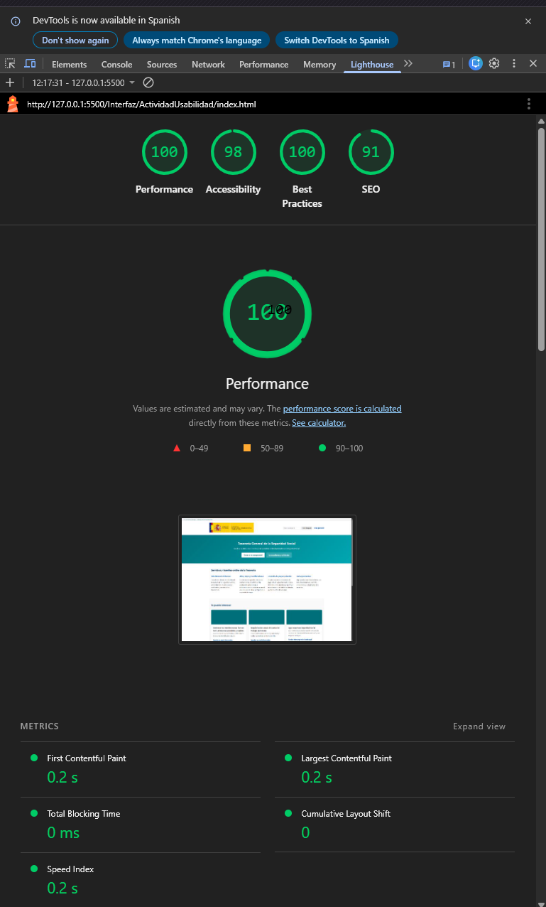
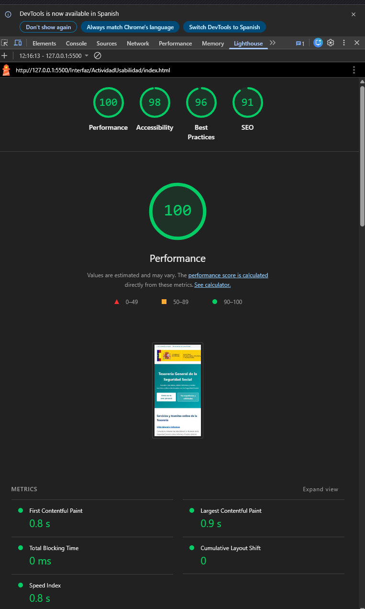

## 📄 Documentación del Proyecto
Puedes consultar el informe detallado en formato PDF aquí:
[Descargar Informe Bloque 3 - Refactorización (PDF)](../ActividadUsabilidad/InformeDeAuditoríaTécnica.pdf)

---

# Informe de Refactorización: Portal Importass (Seguridad Social)

Este proyecto representa el **Bloque 3** de la evaluación de Usabilidad. Se ha realizado una propuesta de mejora técnica (refactorización) sobre la sección de trámites de la Tesorería General de la Seguridad Social, enfocándose en la accesibilidad, el rendimiento y la experiencia de usuario (UX).

## 🛠️ Cambios Técnicos Realizados

### 1. Estructura HTML5 Semántica
Se ha migrado de una estructura de listas planas a un sistema de **componentes independientes (Cards)**. 
- **Semántica:** Uso de etiquetas `<header>`, `<main>`, `<section>` y `<article>` para facilitar la navegación con lectores de pantalla (Screen Readers).
- **Accesibilidad:** Implementación de una barra de accesibilidad con "Skip Links" para permitir que usuarios con discapacidad motriz salten directamente al contenido principal.

### 2. Modernización con CSS3
Se ha aplicado una hoja de estilos moderna separada del HTML:
- **Layout:** Uso de **CSS Grid** para crear una rejilla flexible que se adapta automáticamente a cualquier tamaño de pantalla (Responsive Design).
- **Microinteracciones (Hovers):** Se han diseñado estados de interacción para todos los elementos clicables. Al pasar el ratón, las tarjetas cambian de color, se elevan ligeramente y las sombras se profundizan, proporcionando un *feedback* visual inmediato.
- **Jerarquía Visual:** Aplicación de tipografía `Segoe UI` con pesos diferenciados para guiar el ojo del usuario desde los títulos hacia las descripciones.

## 🧠 Justificación de Usabilidad (UX)

La propuesta se apoya en principios fundamentales del diseño de interfaces:

* **Ley de Fitts:** Al transformar enlaces de texto pequeños en tarjetas de gran formato, el "objetivo" de clic es mayor, reduciendo el error del usuario y acelerando la navegación.
* **Ley de la Región Común:** Al encerrar cada trámite en un recuadro (card), el cerebro percibe que la información de ese trámite está relacionada, separándola claramente de los demás.
* **Heurística de Nielsen #8 (Diseño Minimalista):** Se ha eliminado el ruido visual del portal original, dejando solo la información crítica para reducir la fatiga visual de usuarios mayores o con poca experiencia digital.

## 🖼️ Guía de Recursos

Para que el prototipo se visualice correctamente, se han utilizado los siguientes recursos:

| Recurso | Descripción | Atributo ALT (Accesibilidad) |
| :--- | :--- | :--- |
| **Logo Ministerio** | Imagen oficial institucional | Logo Ministerio de Inclusión, Seguridad Social y Migraciones |
| **Imágenes de Interés** | Fotos temáticas (Oficina, App, Autónomo) | Descripción clara de la escena para invidentes |
| **Degradados CSS** | Colores corporativos (`#00707c` y `#00a8b5`) | N/A (Decorativo) |

---

## 🚀 Resultados

*Figura 1: Auditoría de accesibilidad y rendimiento post-refactorización - PC.*

*Figura 2: Auditoría de accesibilidad y rendimiento post-refactorización - Móvil.*

